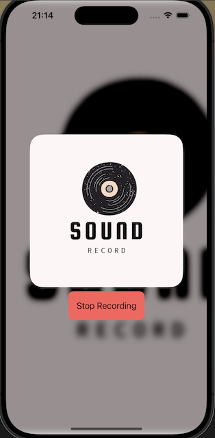

# ShazamAPI app

### ฟังก์ชันการทำงาน
เป็น app สำหรับใช้ในการตามหาเพลงที่ไม่รู้จักจากเสียงเพลงบางส่วน

- หน้า app จะมีปุ่ม Start Recording เพื่อทำการอัดเสียงเพลงที่ต้องการ Search\

- หลังจากอัดเสียงเพลงที่ต้องการ Search ระยะหนึ่ง ให้กด Stop Recording เพื่อหยุดการอัดเสียง\

- หลังจาก Stop Recording แล้ว app จะใช้เวลาครู่หนึ่งในการประมวลผลและแสดงผลการค้นหาที่ได้
- โดยจะแสดงข้อความ "No track data found." หากไม่สามารถประมวลผลจากเสียงที่ได้รับได้

- และแสดงข้อมูลชื่อเพลง นักร้อง และลิงก์ที่นำไปยังเพลงดังกล่าว หากสามารถประมวลผลได้

   
Click [here](https://drive.google.com/file/d/1AtEtQUyJf-Thx-Dcbn7Vn5UJtoK_TlMz/view?usp=sharing) for clip demo.

**สุภาพันธ์ หง่อสกุล 6410615147**
